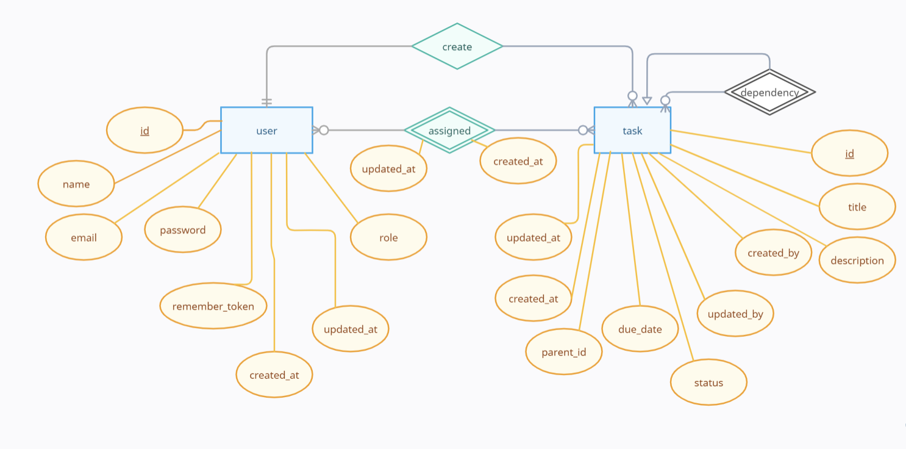

# Task Management API

This Laravel RESTful API, named "task_management_api," allows you to manage tasks, user authentication, and related operations.

## Prerequisites

Before you begin, make sure you have the following installed:

- [Laravel](https://laravel.com/) (with Composer)
- [Postman](https://www.postman.com/) for testing API requests

## Setup Instructions

1. **Clone the Repository:**

    ```bash
    git clone https://github.com/aboudeif/task_managemant_api.git
    cd task_management_api
    ```

2. **Install Dependencies:**

    ```bash
    composer install
    ```

3. **Configure Environment:**

    - Duplicate the `.env.example` file and rename it to `.env`.
    - Configure your database settings in the `.env` file.

4. **Generate Application Key:**

    ```bash
    php artisan key:generate
    ```

5. **Run Migrations and Seeders:**

    ```bash
    php artisan migrate --seed
    ```

6. **Start the Development Server:**

    ```bash
    php artisan serve
    ```

   The API will be accessible at `http://127.0.0.1`.

## Entity Relationship Diagram (ERD)

### User and Task Relationship



# Entity-Relationship Diagram (ERD) Description

## Users
**Attributes:**
- `id` (Primary Key)
- `name`
- `email`
- `password`
- `role`
- `created_at`
- `updated_at`

**Relationships:**
- One-to-Many with Task: `createdTasks` (Tasks created by the user)
- One-to-Many with Task: `updatedTasks` (Tasks updated by the user)
- Many-to-Many with Task: `assignedTasks` (Tasks assigned to the user)

## Tasks
**Attributes:**
- `id` (Primary Key)
- `title`
- `description`
- `status` (Enum: 'pending', 'completed', 'canceled')
- `due_date`
- `parent_id` (Foreign Key)
- `created_by` (Foreign Key)
- `updated_by` (Foreign Key)
- `created_at`
- `updated_at`

**Relationships:**
- Many-to-One with User: `createdByUser` (User who created the task)
- Many-to-One with User: `updatedByUser` (User who last updated the task)
- One-to-Many with Task: `dependencies` (Dependent tasks associated with the task)
- Many-to-Many with User: `assignedUsers` (Users assigned to the task)
- Many-to-Many with Task (Self-Referential): `dependencies` (Tasks that are dependencies of the current task)

## Assignments
**Attributes:**
- `user_id` (Foreign Key, Composite Primary Key)
- `task_id` (Foreign Key, Composite Primary Key)
- `created_at`
- `updated_at`

**Relationships:**
- Many-to-One with User: `user` (User associated with the assignment)
- Many-to-One with Task: `task` (Task associated with the assignment)

### Laravel API Database Compelete Digram


## Default Laravel Tables
- `users` (Default Laravel users table)
- `password_resets` (Default Laravel password resets table)
- `migrations` (Default Laravel migrations table)
- `failed_jobs` (Default Laravel failed jobs table)

## Default Sanctum Tables
- `personal_access_tokens` (Default Sanctum personal access tokens table)

## Import Postman Collection

Download the [Postman Collection](<Documets/Version 1.0.postman_collection.json>) file.

1. Open Postman.

2. Click on "Import" in the top-left corner.

3. Upload the downloaded Postman Collection file.

## Run API Requests

Follow the steps below to test API requests using the Postman collection:

1. **Login:**
   - Use the "Login" request in the Postman collection.
   - Set the email and password in the request body.
   - Obtain the `token_from_login_response` from the response.

2. **Retrieve All User's Tasks:**
   - Use the "Retrieve All User's Tasks" request.
   - Set the Authorization header with the obtained token.

3. **Retrieve All Tasks:**
   - Use the "Retrieve All Tasks" request.
   - Set the Authorization header with the obtained token.

...

12. **Logout:**
    - Use the "Logout" request.
    - Set the Authorization header with the obtained token.

